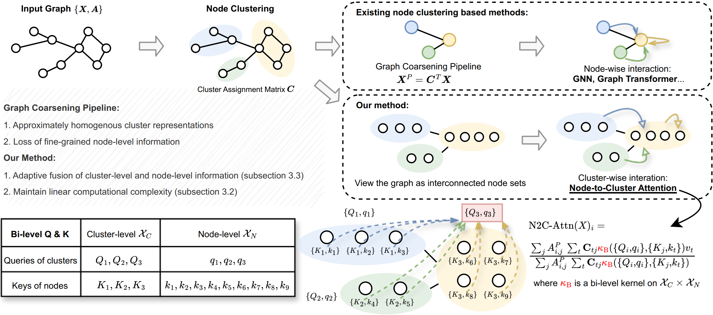

# Cluster-wise Graph Transformer

**This work was accepted as NeurIPS 2024 Spotlight.**

In this work, we present the Cluster-wise Graph Transformer (Cluster-GT), a novel architecture for graph-level tasks that utilizes node clusters as tokens and employs our proposed Node-to-Cluster Attention (N2C-Attn) module.

## Introduction

In the realm of graph learning, there is a category of methods that conceptualize graphs as hierarchical structures, utilizing node clustering to capture broader structural information. While generally effective, these methods often rely on a fixed graph coarsening routine, leading to overly homogeneous cluster representations and loss of node-level information. In this paper, we envision the graph as a network of interconnected node sets without compressing each cluster into a single embedding. To enable effective information transfer among these node sets, we propose the Node-to-Cluster Attention (N2C-Attn) mechanism. N2C-Attn incorporates techniques from Multiple Kernel Learning into the kernelized attention framework, effectively capturing information at both node and cluster levels. We then devise an efficient form for N2C-Attn using the cluster-wise message-passing framework, achieving linear time complexity. We further analyze how N2C-Attn combines bi-level feature maps of queries and keys, demonstrating its capability to merge dual-granularity information. The resulting architecture, Cluster-wise Graph Transformer (Cluster-GT), which uses node clusters as tokens and employs our proposed N2C-Attn module, shows superior performance on various graph-level tasks.



## Dependencies

Ensure the following package versions are installed:

```plaintext
python==3.8.18
pytorch==1.8.1
torch_geometric==1.6.3
torch_sparse==0.6.12
torch_scatter==2.0.8
torch_cluster==1.5.9
torch_spline_conv==1.2.1
torchmetrics==0.2.0
wandb==0.12.16
```

## Data Preparation

First, unzip the `datasets.zip` file in the source code directory as follows:

```
source code directory/
├── commands/
├── datasets/
│   ├── COLLAB/
│   ├── DD/
│   └── ...
├── wandb_script/
├── wandb_yamls/
└── ...
```

## Setup and Execution Guide

### Quick Start

For initial testing, run the `main.py` file:

```bash
python main.py
```

Modify the parameters as required by following the guidelines in `main.py`.

### Formal Experiments Setup

For detailed experiments, use the WandB platform. Follow the setup instructions below:

#### 1. Configuration

Create `configs` and `remote` folders within the root directory to organize your WandB configuration files.

#### 2. Initiating Sweep

Start a parameter sweep with the following command:

```bash
python wandb_script/sweep.py --entity=$YOUR_WANDB_ENTITY$ --project=$YOUR_WANDB_PROJECT$ --source=file --info=$YOUR_YAML_CONFIG$
```

- Replace `$YOUR_WANDB_ENTITY$`, `$YOUR_WANDB_PROJECT$`, and `$YOUR_YAML_CONFIG$` with your WandB username, project name, and YAML configuration file, respectively.

#### 3. Initiating Agent

After starting the sweep, you will receive a sweep ID and URL:

```plaintext
Create sweep with ID: $SWEEP_ID$
Sweep URL: $SWEEP_URL$
```

Execute the program:

- **Single Process Execution:**

  ```bash
  python wandb_script/agents.py --entity=$YOUR_WANDB_ENTITY$ --project=$YOUR_WANDB_PROJECT$ --sweep_id=$SWEEP_ID$ --gpu_allocate=$INDEX_GPU$:1 --wandb_base=remote --mode=one-by-one --save_model=False
  ```

- **Parallel Execution:**

  For running multiple experiments concurrently, specify your GPU indices and the number of parallel runs:

  ```bash
  python wandb_script/agents.py --entity=$YOUR_WANDB_ENTITY$ --project=$YOUR_WANDB_PROJECT$ --sweep_id=$SWEEP_ID$ --gpu_allocate=$INDEX_GPU_1$:$PARALLEL_RUNS$-$INDEX_GPU_2$:$PARALLEL_RUNS$ --wandb_base=remote --mode=parallel --save_model=False
  ```

#### 4. Results Evaluation

Visit the `$SWEEP_URL$` to view and analyze the experiment results on [wandb.ai](https://wandb.ai).